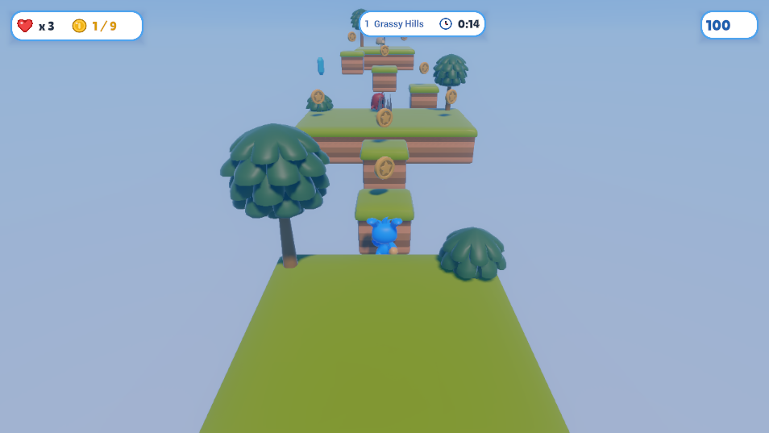
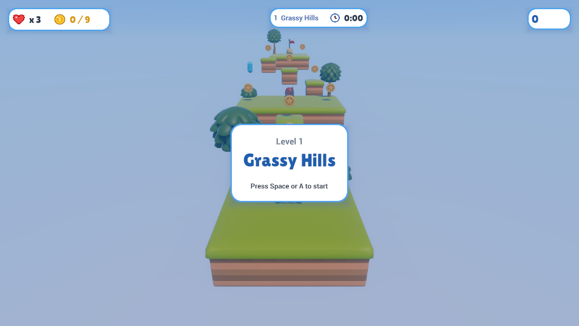
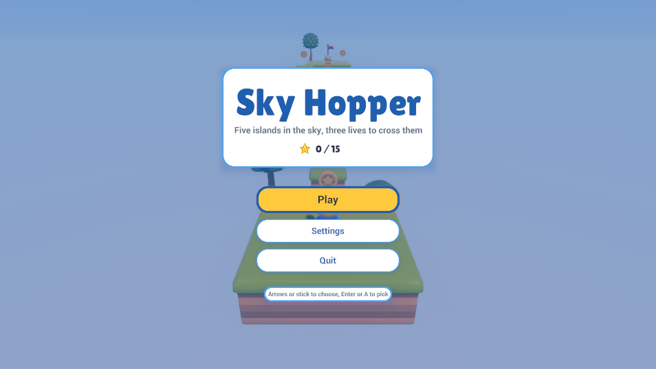
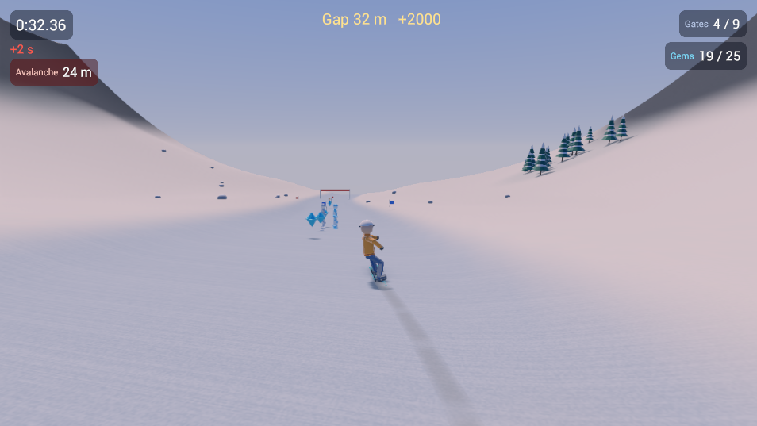
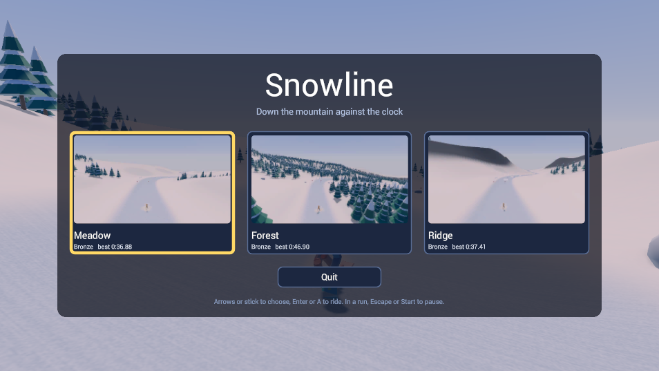
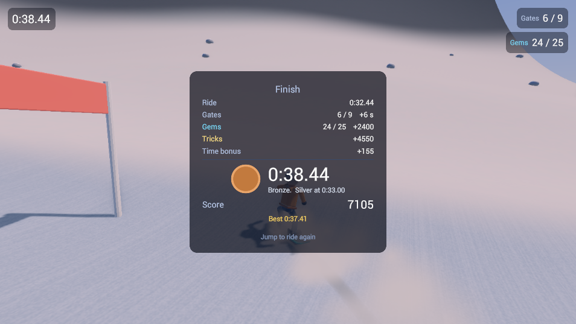

# Sedulous Demos

Browser builds of games made with the Sedulous engine
([SedulousWorks/SedulousEngine](https://github.com/SedulousWorks/SedulousEngine)), served by
GitHub Pages at **https://sedulousworks.github.io/SedulousDemos/**. They need WebGPU: a recent
Chrome or Edge on a computer.

## Sky Hopper

A 3D platformer across five floating islands: collect coins, stomp crabs, skulls and bees, dodge
saws and spiky balls, and reach the flag. Three lives for the whole run; stars and best scores are
saved in your browser. Keyboard (WASD, Space, Escape) or a gamepad.

**[Play Sky Hopper](https://sedulousworks.github.io/SedulousDemos/SkyHopper/)**

  
  
  

The engine's `Data/SampleProjects/PlatformerGame`. Credits and licences: `SkyHopper/CREDITS.md`
and `SkyHopper/Licenses/`.

## PaperKid

An arcade paper route: ride round a town block and throw papers onto the subscribers' porches
before time runs out, dodging cars, pedestrians, bins and cones. Five blocks, three lives, and a
minimap of the block. Keyboard (WASD, Space, Escape) or a gamepad.

**[Play PaperKid](https://sedulousworks.github.io/SedulousDemos/PaperKid/)**

  
  
  

The engine's `Data/SampleProjects/PaperKid`. Credits and licences: `PaperKid/CREDITS.md` and
`PaperKid/Licenses/`.

## Snowline

A snowboard time trial with tricks: carve through slalom gates, take the gems, and hit the kickers
for spins and grabs. Three courses opened by medals (Meadow, Forest with its shortcut through the
trees, and Ridge with a gap over a crevasse and an avalanche chasing you down); medal ghosts ride
beside you and your best run becomes your own ghost. Keyboard (A and D, Space, Left Shift, E,
Escape) or a gamepad.

**[Play Snowline](https://sedulousworks.github.io/SedulousDemos/Snowline/)**

  
  
  

The engine's `Data/SampleProjects/Snowline`. Credits and licences: `Snowline/CREDITS.md` and
`Snowline/Licenses/`.

## How the builds are made

Each game folder is a web export straight from the engine: the project's Web export preset with the
Release web template, giving the page, the wasm player, its script and the content packs. To update
one, export again and replace the folder (leaving out `serve.py`, which serves an export locally,
and any certificate it made). The credits and `Licenses/` come from the project.
